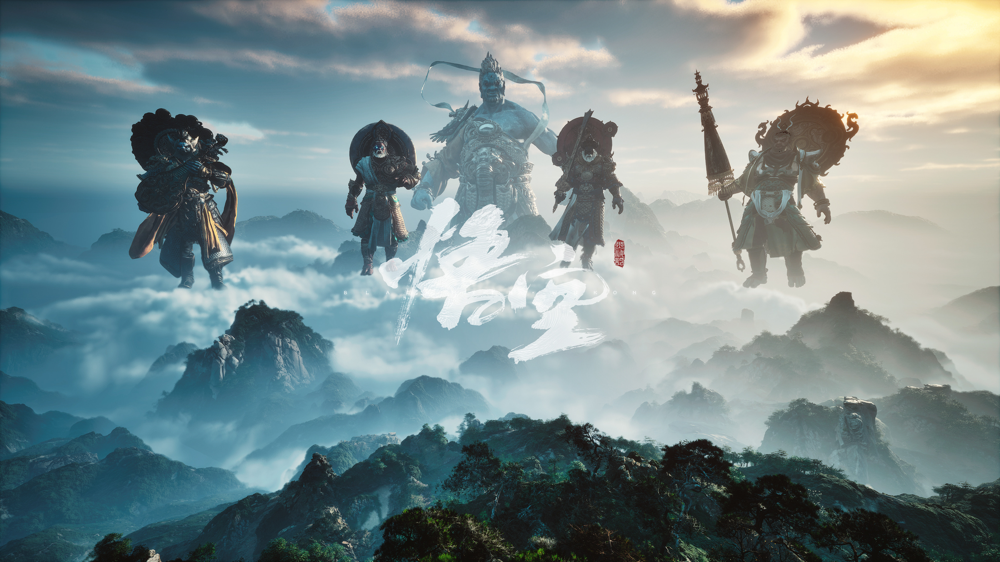

# Black Myth: Wukong (黑神话：悟空) — Omarchy Theme

An evocative, epic dark theme for [Omarchy](https://omarchy.org), inspired by Game Science's masterpiece *Black Myth: Wukong* (黑神话：悟空).

Immerse yourself in traditional Chinese mythology, Buddhist grottoes, weathered rock shrines, blazing sacred relics, and golden halos beneath snow-swept mountains.



## Install

```bash
omarchy theme install https://github.com/hongyangchun/omarchy-black-myth-wukong-theme.git
```

Or from the desktop: `Super + Alt + Space` → **Install** → **Style** → **Theme**, then paste the repository URL above.

To activate:
```bash
omarchy theme set "Black Myth Wukong"
```

## Design Philosophy

- **Background & Canvas (`#0f1013`, `#090a0d`)**: Ancient Buddhist grotto stone (佛窟玄石), incense ash shadows, and cold mountain slate.
- **Foreground & Text (`#ded8cb`, `#f7f2e7`)**: Weathered Xuan paper and sacred sutra silk parchment (宣纸绢白).
- **Primary Accent (`#dfa234`)**: Buddha relic halo gold (佛光耀金) and the gleaming bands of the Ruyi Jingu Bang (如意金箍棒).
- **Secondary Accent (`#b53b28`)**: Cinnabar flame (避火丹砂赤铜) and sacred monk robe vermilion.
- **Hyprland Dual-Tone Active Gradient**: `rgba(dfa234ee) rgba(b53b28ee) 45deg` — a 45-degree transition from sacred Buddha Gold into Cinnabar Flame.
- **Muted & Selection (`#2c2621`, `#6b645b`)**: Sandalwood incense embers and weathered stone statues.

## Palette Reference

| Token | Hex | Aesthetic / Lore |
|---|---|---|
| `background` | `#0f1013` | 佛窟玄石 (Ancient grotto black stone) |
| `dark_background` | `#090a0d` | 灵台幽夜 (Night over Lingtai mountain) |
| `darker_background` | `#050608` | 深渊太虚 (Abyssal void) |
| `lighter_background` | `#191a20` | 青铜古鼎 (Lacquered bronze vessel) |
| `foreground` | `#ded8cb` | 宣纸绢白 (Ancient Xuan paper & sutra silk) |
| `bright_foreground` | `#f7f2e7` | 灵霄云白 (Celestial cloud light) |
| `accent` | `#dfa234` | 佛光耀金 (Buddha relic halo gold) |
| `selection` | `#2c2621` | 沉香余烬 (Sandalwood incense ash) |
| `muted` | `#6b645b` | 古刹石青 (Weathered shrine granite) |
| `red` | `#b53b28` | 丹砂赤炎 (Cinnabar flame & monk mantle) |
| `orange` | `#cb682c` | 袈裟赤铜 (Monk robe bronze & embers) |
| `yellow` | `#dfa234` | 佛光圣金 (Sacred relic gold) |
| `green` | `#568761` | 苍松古柏 (Mountain pine & bamboo grove) |
| `cyan` | `#4b8c88` | 定身青光 (Immobilize spell cyan) |
| `blue` | `#466b96` | 飞雪小西天 (Snow over Thunderclap Pagoda) |
| `magenta` | `#8f587a` | 盘丝幽紫 (Demonic silk violet) |
| `brown` | `#785135` | 枯木沉香 (Ancient grotto wood & soil) |

## Wallpapers (Backgrounds)

Includes 12 curated 4K ultra-definition artworks:
1. `01-destined-one-staff.jpg` — 天命人执棒立于悬崖 (Destined One with Jingubang staff, 4K)
2. `02-buddha-grotto-statue.jpg` — 巨佛石窟残垣与神圣雕刻 (Ancient carved Buddha grotto, 4K)
3. `03-thunderclap-temple-snow.jpg` — 小西天小雷音寺漫天飞雪 (Snow over New Thunderclap Temple, 4K)
4. `04-yellow-wind-ridge.jpg` — 黄风岭大漠残阳落日 (Sunset over Yellow Wind Ridge, 4K)
5. `05-four-heavenly-kings.jpg` — 四大天王巍然俯瞰 (The Four Heavenly Kings in the clouds, 4K)
6. `06-golden-fillet-wukong.jpg` — 齐天大圣紧箍与金光 (Golden Fillet & Sun Wukong, 4K)
7. `07-flaming-mountains.jpg` — 火焰山熔岩火海 (Lava & fire of Flaming Mountains, 4K)
8. `08-black-wind-mountain.jpg` — 黑风山幽深山林 (Black Wind Mountain misty pine forest, 4K)
9. `09-wukong-relic-armor.jpg` — 大圣点翠锁子甲与凤翅紫金冠 (Monkey King full relic armor, 4K)
10. `10-pagoda-realm-snow.jpg` — 浮屠界白雪皑皑宝塔 (Snow pagoda in Pagoda Realm, 4K)
11. `11-destined-one-vista.jpg` — 苍茫云海天命远眺 (Destined One overlooking mountain vista, 4K)
12. `12-heavenly-court-clouds.jpg` — 灵霄宝殿与南天门仙境 (Southern Heavenly Gate palace clouds, 5K)

Cycle wallpapers:
```bash
omarchy theme bg next
```
Or open the graphical selector:
```bash
omarchy theme bg-switcher
# Shortcut: Super + Alt + W
```

## Typography & Fonts (字体搭配)

- **Terminal & Code**: `Maple Mono NF CN` or `JetBrainsMono Nerd Font`.
- **UI & Titles**: `Noto Serif CJK SC` (Traditional Chinese Song/Mincho calligraphy aesthetic for classical mythological immersion).
- Switch system font anytime:
  ```bash
  omarchy font set "Maple Mono NF CN"
  ```

## Switching & Reverting (主题切换与撤回)

### Activate Black Myth: Wukong:
```bash
omarchy theme set "Black Myth Wukong"
```

### Revert to Another Theme:
Switching back is instant and non-destructive:
```bash
omarchy theme set "Ghost Of Tsushima"
# or
omarchy theme set "No Rest For The Wicked"
```

## Icons

Defaulted to `Yaru-yellow-dark` to match the golden Buddhist relic accents.

## License

MIT — see [LICENSE](LICENSE). Artworks and game trademarks © Game Science (游戏科学).

---

> This theme was made with the [omarchy-theme-skill](https://github.com/hongyangchun/omarchy-theme-skill) - the pipeline that sources art, builds palettes and ships the repo.
